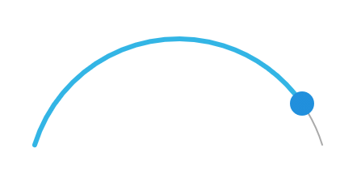
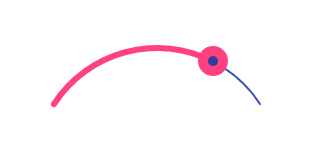

# ArcSeekBar

Library used to make good looking curved SeekBars.

[](https://jitpack.io/#marcinmoskala/ArcSeekBar)

## Usage

Library can be used to make good-looking curved SeekBar:
 


Here are some usage examples:



```xml
<com.marcinmoskala.arcseekbar.ArcSeekBar
    android:layout_width="300dp"
    android:layout_height="150dp"
    android:layout_margin="20dp"
    android:padding="20dp" />
```



```xml
<com.marcinmoskala.arcseekbar.ArcSeekBar
    app:progressDrawable="@drawable/thumb2"
    app:progressColor="@color/colorAccent"
    app:progressBackgroundColor="@color/colorPrimary"
    android:layout_width="200dp"
    android:layout_height="100dp"
    android:layout_margin="20dp"
    android:padding="20dp" />
```

[Here](https://github.com/MarcinMoskala/ArcSeekBar/blob/master/app/src/main/res/drawable/thumb2.xml) is progress drawable `thumb2` definition.


```xml
<com.marcinmoskala.arcseekbar.ArcSeekBar
    android:id="@+id/seekArc"
    android:layout_width="match_parent"
    android:layout_height="100dp"
    android:layout_margin="20dp"
    android:padding="20dp"
    app:progressBackgroundColor="@color/sliderBack"
    app:progressBackgroundWidth="20dp"
    app:progress="100"
    app:progressWidth="20dp"
    app:roundEdges="true" />
```

To make gradient, you need to define it from code:

```java
int[] intArray = getResources().getIntArray(R.array.progressGradientColors);
seekArc.setProgressGradient(intArray);
```

[Here](https://github.com/MarcinMoskala/ArcSeekBar/blob/master/app/src/main/res/values/colors.xml) you can find array definition.

## Installation

Just add in your module `build.gradle` following dependency:

```groovy
dependencies {
    compile 'com.github.marcinmoskala:ArcSeekBar:0.10'
}
```

Also add on your module `build.gradle` (unless you already have it):

```groovy
repositories {
    maven { url 'https://jitpack.io' }
}
```